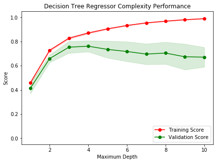

# Project: Predicting Boston Housing Prices
*Model Evaluation and Validation*

[Project Description](others/project_description.md)

Main:

- [boston_housing.ipynb](https://github.com/Haoran830/Machine-Learning-Nanodegree/blob/master/1-Predicting-Boston-Housing-Prices/boston_housing.ipynb) ([boston_housing.html](https://haoran830.github.io/Machine-Learning-Nanodegree/1-Predicting-Boston-Housing-Prices/others/boston_housing.html))

## Install

This project requires **Python** and the following Python libraries installed:

- [NumPy](http://www.numpy.org/)
- [Pandas](http://pandas.pydata.org/)
- [matplotlib](http://matplotlib.org/)
- [scikit-learn](http://scikit-learn.org/stable/)

You will also need to have software installed to run and execute a [Jupyter Notebook](http://ipython.org/notebook.html)

## Run

In a terminal or command window, navigate to the top-level project directory (that contains this README) and run the following commands. This will open the Jupyter Notebook and project file in your browser.

```bash
jupyter notebook boston_housing.ipynb
```

## Data

The modified Boston housing dataset consists of 489 data points, with each datapoint having 3 features. This dataset is a modified version of the Boston Housing dataset found on the [UCI Machine Learning Repository](https://archive.ics.uci.edu/ml/datasets/Housing).

**Features**
1.  `RM`: average number of rooms per dwelling
2. `LSTAT`: percentage of population considered lower status
3. `PTRATIO`: pupil-teacher ratio by town

**Target Variable**
4. `MEDV`: median value of owner-occupied homes

## Result
Performance metric: [coefficient of determination](https://stattrek.com/statistics/dictionary.aspx?definition=coefficient_of_determination) (`sklearn.metrics.r2_score`)



- Training Score =  0.7806
- Testing Score = 0.6849
